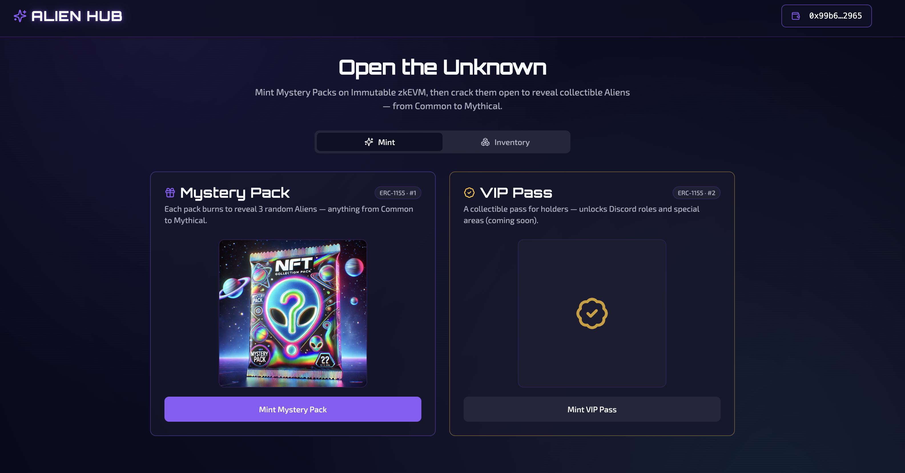
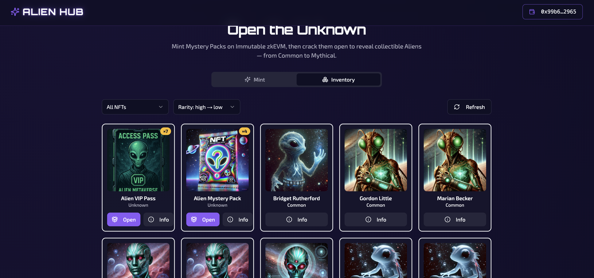
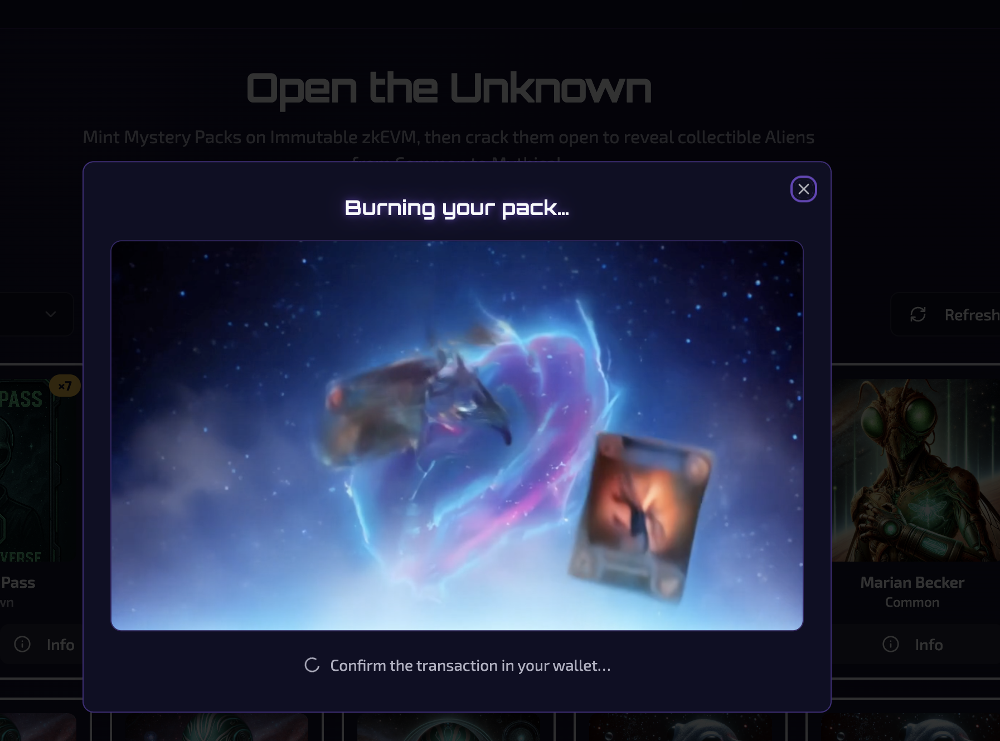

<div align="center">

# 👽 Alien Hub — Mystery Pack

### Mint Mystery Packs on Immutable zkEVM, then crack them open to reveal collectible Aliens — from Common to Mythical.

[](https://mysterypack-eight.vercel.app/)
[](https://nextjs.org/)
[](https://www.immutable.com/zkEVM)
[](#-license)



</div>

---

## ✨ Overview

**Alien Hub** is an end-to-end demo of an NFT *mystery pack* mechanic built on the
[Immutable zkEVM](https://www.immutable.com/zkEVM) (sandbox / testnet).

Players sign in with **Immutable Passport**, mint an ERC‑1155 **Mystery Pack**, then
**open** it. Opening **burns** the pack on‑chain — a backend webhook listens for that
burn event and mints **3 random Alien NFTs** in response, which the frontend reveals
with an animated flow. Rarity ranges from Common → Rare → Legendary → Mythical.

It’s a compact, production‑shaped reference for the full Immutable stack: Passport auth,
the Blockchain Data API, server‑side minting, and event‑driven webhooks.

---

## 📸 Screenshots

| Mint | Inventory | Pack opening |
| :---: | :---: | :---: |
|  |  |  |
| Rarity‑accented mint cards for Packs & VIP Pass | Inventory grid with rarity glow, filter & sort | Burn → scan → reveal animated flow |

---

## 🎮 Features

- **Mint** — Mystery Packs (ERC‑1155 id `1`) and VIP Passes (id `2`).
- **Open a pack** — burns the token on‑chain, then reveals **3 random Aliens**.
- **Rarity system** — Common · Rare · Legendary · Mythical, with a shared
  colour/glow scale and rarity‑aware sorting.
- **Inventory** — collection filter, rarity sort, loading skeletons, empty states,
  and error/retry handling.
- **NFT details** — per‑token metadata dialog (attributes, contract, token id).
- **Wallet** — Immutable Passport via a single shared `EIP1193Context`
  (silent auto‑reconnect, connect / disconnect).
- **Design** — cyberpunk‑neon system (Orbitron + Exo 2, violet/gold palette,
  neon glow + scanlines) with full `prefers-reduced-motion` support.

---

## 🔭 How pack opening works

```text
 ┌──────────┐   click "Open"   ┌─────────────────┐   burn(id,1)   ┌──────────────┐
 │  Player  │ ───────────────► │  usePackOpening  │ ─────────────► │  Specials    │
 │ (browser)│                  │      hook        │   (ethers v6)  │  ERC-1155    │
 └──────────┘                  └─────────────────┘                └──────┬───────┘
      ▲                               │                                  │ burn event
      │ reveal 3 aliens               │ poll fetchInventory()            ▼
      │                               │ (diff vs pre-burn snapshot)  ┌──────────────┐
      │                               ▼                              │ /api/webhook │
      │                        ┌──────────────┐    mint 3 aliens     │  (Immutable  │
      └────────────────────────┤  Aliens API  │ ◄────────────────────┤   webhook)   │
                               │  (Blockchain │                      └──────────────┘
                               │   Data API)  │
                               └──────────────┘
```

The orchestration lives in [`hooks/use-pack-opening.tsx`](hooks/use-pack-opening.tsx):
burn → poll the Blockchain Data API → diff against a pre‑burn snapshot → reveal the
newly minted aliens.

---

## 🛠 Tech Stack

| Layer | Tech |
| --- | --- |
| Framework | **Next.js 14** (App Router) |
| Styling | **Tailwind CSS** + **shadcn/ui** (Radix primitives) |
| Animation | **Framer Motion** |
| Web3 | **ethers v6** (on‑chain burn) |
| Immutable | **`@imtbl/sdk`** — Passport, Blockchain Data, Webhooks |
| Hosting | **Vercel** |

---

## 🚀 Getting Started

### Prerequisites

- Node.js 18+
- `yarn`
- An [Immutable Hub](https://hub.immutable.com/) project (Passport client + API key)
  with a deployed ERC‑1155 (packs/VIP) and an Aliens collection.

### 1. Install

```bash
git clone https://github.com/Arturski/mysterypack.git
cd mysterypack
yarn install
```

### 2. Configure environment

Copy the example and fill in your values:

```bash
cp .env.example .env.local
```

If the repo is linked to Vercel, you can pull them instead:

```bash
vercel env pull .env.local
```

| Variable | Purpose |
| --- | --- |
| `NEXT_PUBLIC_PUBLISHABLE_KEY` | Immutable Hub publishable key |
| `NEXT_PUBLIC_CLIENT_ID` | Passport client id |
| `NEXT_PUBLIC_IMMUTABLE_REDIRECT_URI` | Passport login redirect (`/redirect`) |
| `NEXT_PUBLIC_API_BASE_URL` | Passport logout redirect |
| `NEXT_PUBLIC_SPECIALS_CONTRACT_ADDRESS` | ERC‑1155 contract — Packs (id 1) & VIP Pass (id 2) |
| `NEXT_PUBLIC_ALIENS_CONTRACT_ADDRESS` | Collection the Aliens are minted into |
| `API_KEY` | Immutable Blockchain Data API key (server‑side minting) |

> **Passport redirect URIs must be whitelisted** in Immutable Hub. For local dev set
> `NEXT_PUBLIC_IMMUTABLE_REDIRECT_URI=http://localhost:3000/redirect` and add that URI
> to your Passport client’s allowed callback URLs.

### 3. Run

```bash
yarn dev
# → http://localhost:3000
```

---

## 🧾 Deployed contracts (Immutable zkEVM Testnet / Sandbox)

| Contract | Address |
| --- | --- |
| Specials (Packs id 1 · VIP Pass id 2) | [`0xb001670b074140aa6942fbf62539562c65843719`](https://explorer.testnet.immutable.com/address/0xb001670b074140aa6942fbf62539562c65843719) |
| Aliens | [`0x0b0c90da7d6c8a170cf3ef8e9f4ebe53682d3671`](https://explorer.testnet.immutable.com/address/0x0b0c90da7d6c8a170cf3ef8e9f4ebe53682d3671) |

---

## 📁 Project structure

```text
app/
├─ api/
│  ├─ mint/route.ts        # server-side mint (Packs / VIP Pass)
│  └─ webhook/route.ts     # Immutable webhook → mints aliens on burn
├─ context/
│  └─ EIP1193Context.tsx   # single wallet source of truth (ethers v6 + Passport)
├─ redirect/page.tsx       # Passport OAuth callback
├─ layout.tsx · page.tsx   # app shell (fonts, theme, tabs)
components/
├─ mint-*.tsx              # mint cards + success dialog
├─ inventory*.tsx          # inventory grid, cards, states
├─ alien-reveal-modal.tsx  # burn / reveal animation modal
└─ ui/                     # shadcn/ui primitives
hooks/
├─ use-pack-opening.tsx    # burn → poll → reveal orchestration
└─ use-burn-nft.tsx        # ERC-1155 burn via the shared provider
lib/
├─ api.ts · client.ts      # Blockchain Data API helpers
├─ rarity.ts               # shared rarity scale + styling
└─ constants.ts
```

---

## ☁️ Deployment

The app deploys to **Vercel**. With the project linked:

```bash
vercel --prod
```

Make sure the production domain’s `/redirect` URL is registered as an allowed
Passport callback in Immutable Hub.

---

## 🗺 Roadmap

- [ ] Event‑driven inventory updates (WebSocket / push instead of polling).
- [ ] VIP Pass utility — Discord role verification / gated areas.
- [ ] Auth + rate limiting on `/api/mint`; webhook signature verification.

---

## ⚠️ Known limitations

- The reveal uses **polling** of the Blockchain Data API after the burn. An
  event‑driven push to the client would be lower‑latency; left as a future
  improvement.
- The sandbox `/api/mint` route has **no auth or rate limiting**, and the webhook
  does **not verify the SNS signature** — fine for a testnet demo, not for
  production.

---

## 🤝 Contributing

Issues and PRs welcome. Please run `yarn build` before opening a PR to ensure the
project type‑checks and builds.

---

## 📄 License

[MIT](LICENSE) © Arturski
